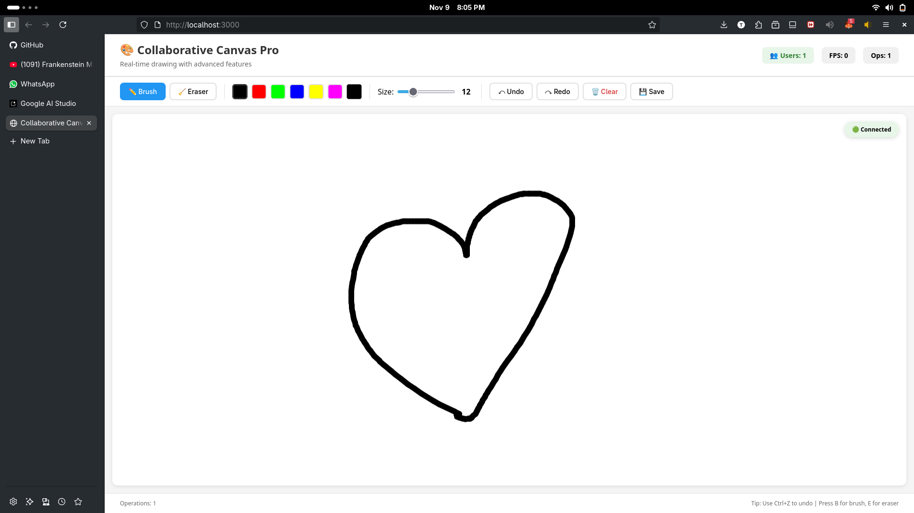

# 🎨 Collaborative Canvas Pro

A **real-time collaborative drawing app** that lets multiple users draw together on a shared canvas — instantly, interactively, and creatively!

---

## ✨ Features

- 🖌️ **Real-time Drawing:** See what others are drawing instantly.  
- 🧰 **Multiple Tools:** Switch between **Brush** and **Eraser**.  
- 🎨 **Color Palette:** Choose from predefined colors or use a custom color picker.  
- 📏 **Adjustable Line Width:** Control the thickness of your strokes.  
- ↩️ **Undo/Redo:** Correct mistakes easily (locally and synchronized).  
- 🧼 **Clear Canvas:** Start fresh with a single click.  
- 💾 **Download Artwork:** Save your masterpiece as a PNG image.  
- 🖱️ **User Cursors:** See where other collaborators are pointing.  
- 👥 **Live User Count & Stats:** Track active users and operations in real-time.  
- 📱 **Responsive Design:** Works smoothly across all screen sizes.  
- ⌨️ **Keyboard Shortcuts:**
  - `Ctrl + Z` → Undo  
  - `Ctrl + Y` or `Ctrl + Shift + Z` → Redo  
  - `B` → Brush  
  - `E` → Eraser  

---

## 🚀 Getting Started

Follow these steps to set up the project locally for development and testing.

### 🧩 Prerequisites

You must have **Node.js** and **npm** installed.

- [Download Node.js](https://nodejs.org/) (includes npm)

## DEPLOYED USING RENDER
https://flam-5bve.onrender.com/

## 🖼️ Preview

